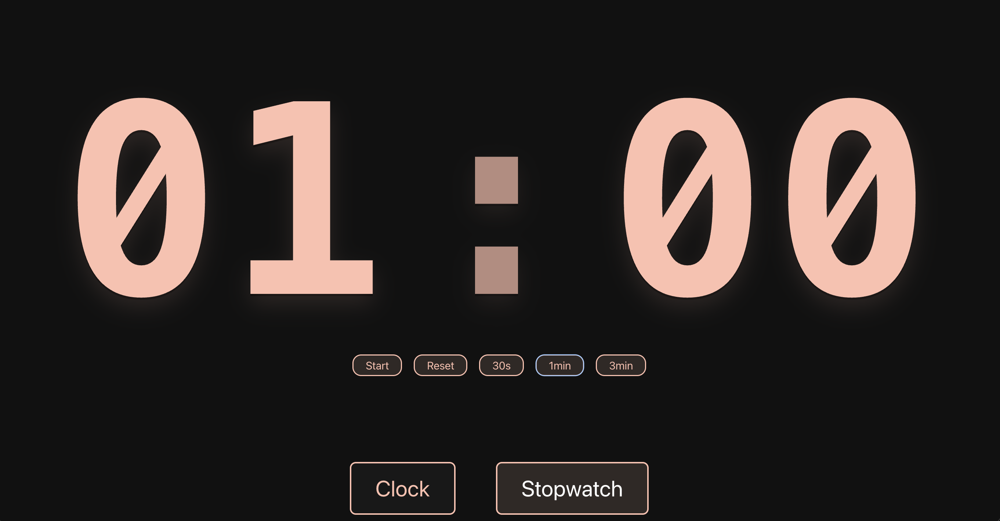

# Clock App



A simple clock and stopwatch application built with React and Vite.

## Features

- Displays the current time in hours and minutes.
- Stopwatch functionality to measure elapsed time.
- Responsive design for various screen sizes.

## Installation

1. Clone the repository:

```bash
git clone https://github.com/iantalabs/clock-app.git
```

2. Navigate to the project directory:

```bash
cd clock-app
```

3. Install dependencies:

```bash
npm install
```

4. Start the development server:

```bash
npm run dev
```

5. Open your browser and go to `http://localhost:3000` to see the application in action.

## Technologies Used

- React: A JavaScript library for building user interfaces.
- Vite: A fast build tool for modern web projects.
- CSS: For styling the application.
